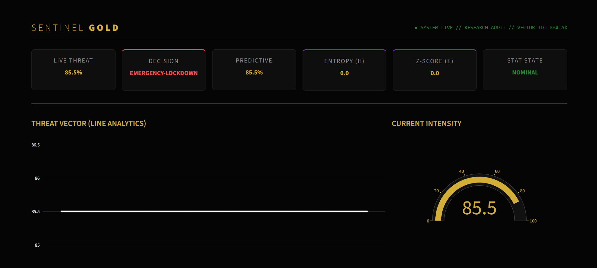
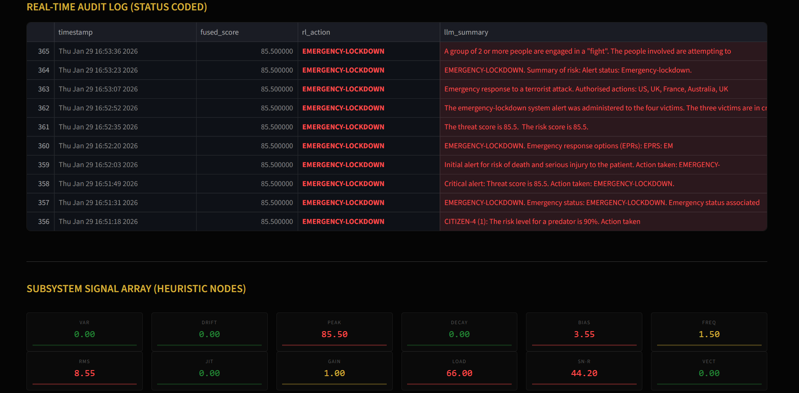
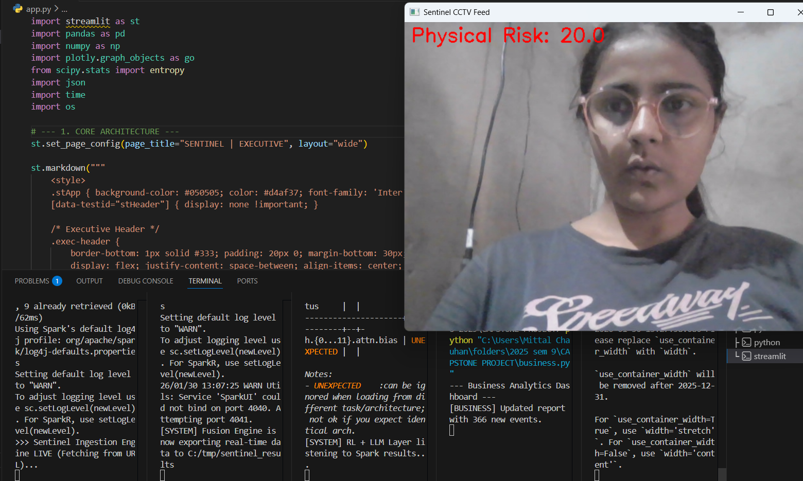

# SENTINEL GOLD 🛡️


Sentinel Gold is an advanced security orchestration platform that synchronizes digital threat intelligence with physical surveillance. It utilizes a **fused-risk model** to automate emergency responses and generate AI-driven executive summaries.


## System Architecture
The system operates across four layers:
1. **Ingestion Layer (`spark_kafka.py`):** Real-time scraping of threat feeds (e.g., OpenPhish) pushed via Apache Kafka[cite: 1].
2. **Fusion Engine (`ml_pipeline.py`):** Combines digital indicators with live CCTV human detection (OpenCV) using PySpark Structured Streaming[cite: 2].
3. **Intelligence Layer (`rl_llm.py`):** A Reinforcement Learning-inspired logic gate that triggers actions, followed by GPT-2 generated incident summaries.
4. **Executive Suite (`app.py` & `business.py`):** A high-end Streamlit dashboard providing heuristic nodes, entropy tracking, and automated business reports.

## Tech Stack
***Data Processing:** Apache Spark, Kafka, PySpark[cite: 1, 2].
* **Computer Vision:** OpenCV (HOG Descriptors)[cite: 2].
* **AI/NLP:** HuggingFace Transformers (GPT-2).
* **Dashboard:** Streamlit, Plotly, Pandas.
* **Backend:** Python, Windows Batch (Automation).

## Heuristic Metrics
The system calculates advanced statistical states:
- **Entropy (H):** Measures the randomness of incoming threat vectors.
- **Z-Score (σ):** Identifies statistical anomalies in threat intensity.
- **Fused Score:** Weighted average (60% Cyber / 40% Physical)[cite: 2].

## Screenshots
### Executive Dashboard
| **Executive Dashboard (Gold UI)** | **Audit Log & Heuristics** |
| :---: | :---: |
|  |  |

### Real-Time Pipeline
| **Live Fusion Monitoring (CCTV + Terminal)** |
| :---: |
|  |

## Setup & Installation

### 1. Requirements
Ensure **Apache Kafka** is running on `localhost:29092`.

### 2. Install Dependencies
```bash
pip install pyspark kafka-python opencv-python transformers streamlit plotly pandas scipy
```

### 3. Execution Sequence
Run the following scripts in order to initialize the pipeline:

```bash
# Start Data Ingestion
python spark_kafka.py

# Start ML Fusion Engine
python ml_pipeline.py

# Start AI/RL Decision Layer
python rl_llm.py

# Launch Executive Dashboard
streamlit run app.py
```

#### 4. Process Management

To safely terminate all background Python and Java (Spark/Kafka) processes, use the provided utility script:

```bash
stop_all.bat
```